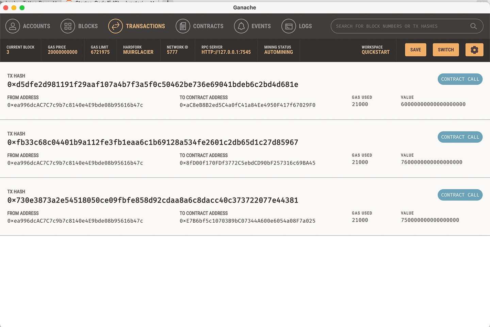

# Fintech Finder
<a href="https://unsplash.com/photos/8iIUDnRq87o?utm_source=unsplash&utm_medium=referral&utm_content=creditShareLink">
<a>  
  
 This application offers a database of FinTech professionals that customers needing FinTech work done can access professionals and pay them directly into their Crypto Wallet according to the associated Ethereum rate.
  
  ---
  

  
  ---
  
  This application is run using <a href="https://trufflesuite.com/ganache/">Ganache<a> as the sample blockchain backend.
  
  ---
  

### Technologies
  
<a href="https://trufflesuite.com/ganache/">Ganache<a> 
<a href="https://streamlit.io/">Streamlit<a> 
<a href="https://www.python.org/">Python<a> 

---
  
### Contributors
Rachel Bates

---
### License
Creative Commons

